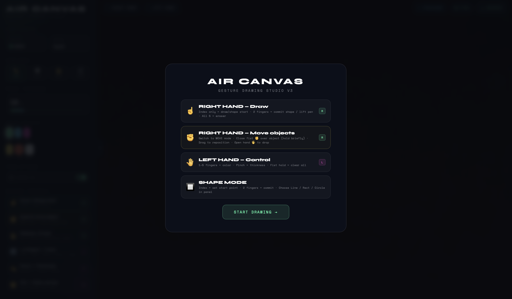
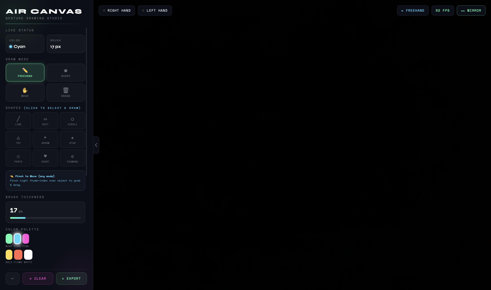

<div align="center">

# ✋ Air Canvas — Gesture Drawing Studio

[](https://developers.google.com/mediapipe)
[](https://developer.mozilla.org/en-US/docs/Web/JavaScript)
[](#-license)
[](https://www.google.com/chrome/)
[](https://github.com/ayuuXploits/air-canvas)

[**🚀 Live Demo**](https://ayuuXploits.github.io/air-canvas/) &nbsp;·&nbsp; [**🐛 Report Bug**](https://github.com/ayuuXploits/air-canvas/issues/new?assignees=&labels=bug&template=bug_report.md&title=%5BBug%5D+) &nbsp;·&nbsp; [**✨ Request Feature**](https://github.com/ayuuXploits/air-canvas/issues/new?assignees=&labels=enhancement&template=feature_request.md&title=%5BFeature%5D+)

> Draw in the air using just your hands — no touch, no mouse, just pure computer vision.




</div>

---

## 📋 Table of Contents

- [Overview](#-overview)
- [Features](#-features)
- [Gesture Reference](#-gesture-reference)
- [Shape Mode](#-shape-mode)
- [Move Mode](#-move-mode)
- [Pinch to Move](#-pinch-to-move)
- [Quick Start](#-quick-start)
- [Tech Stack](#-tech-stack)
- [Project Structure](#-project-structure)
- [Troubleshooting](#-troubleshooting)
- [Contributing](#-contributing)
- [License](#-license)
- [Author](#-author)

---

## 📸 Overview

**Air Canvas** is a browser-based gesture drawing app that uses your webcam and Google's MediaPipe Hands to track your hand movements in real time. Draw freehand strokes, drop precise shapes, move objects around the canvas, and control colors and brush thickness — all without touching a screen.

One `.html` file. No install. No frameworks. Just open and draw.

---

## ✨ Features

| Feature | Description |
|---|---|
| ✏️ Freehand Drawing | Point your right index finger to draw smooth quadratic-curve strokes |
| 🔲 Shape Mode | 9 shapes — line, rect, circle, triangle, arrow, star, pentagon, heart, diamond — with live dashed preview and two-gesture commit |
| ✋ Move Mode | Grab any stroke or shape with a closed fist and drag it anywhere on the canvas |
| 🤏 Pinch to Move | Pinch right thumb + index over any object to grab and drag it — works in **any** mode |
| 🎨 Color Control | Use your left hand finger count to switch between 5 colors with a full-screen flash overlay |
| 🗑️ Eraser Mode | Spread all 5 fingers on the right hand or enable via panel to erase objects |
| 📏 Brush Thickness | Pinch left hand to adjust stroke width in real time with smooth interpolation |
| ↩️ Undo | Ctrl+Z or panel button — up to 30 levels of deep-copy object history |
| ✊ Clear | Hold a left-hand fist for 0.6 s to clear the canvas |
| 💾 Export PNG | Save your artwork as a timestamped PNG file |
| ⟺ Mirror Toggle | Flip the drawing layer independently of the video feed |
| 📡 Hand Skeleton | Live 21-point landmark skeleton drawn on both hands |
| ⚡ FPS Counter | Live rolling-average performance indicator |
| 🎬 Onboarding | First-launch guide overlay with full gesture reference |
| 🔲 Collapsible Panel | Full-screen drawing mode with animated slide-in/out side panel |
| 🖼️ Object Model | Every stroke and shape is stored as a data object — fully movable and undoable |

---

## 🤌 Gesture Reference

### Right Hand — Drawing & Interaction

| Gesture | Action |
|---|---|
| ☝️ Index finger only | Draw stroke (Freehand) / Set shape start point (Shape) |
| ✌️ 2 fingers up | Commit shape (Shape mode) / Lift pen (Freehand) |
| 🤏 Pinch thumb + index | Grab & drag any object — works in all modes |
| 🖐️ All 5 fingers spread | Eraser mode — erase objects under cursor |
| ✊ Closed fist (hold) | Grab object (Move mode) |
| 🖐️ Open hand | Release grabbed object (Move mode) |

### Left Hand — Controls

| Gesture | Action |
|---|---|
| 1 finger | Color → Pink |
| 2 fingers | Color → Cyan |
| 3 fingers | Color → Mint |
| 4 fingers | Color → Gold |
| 5 fingers | Color → Flame |
| 🤏 Pinch | Adjust brush thickness (spread = thicker, narrow = thinner) |
| ✊ Fist (hold 0.6 s) | Clear entire canvas |

---

## 🔲 Shape Mode

Switch to **Shape** mode in the side panel (or just click any shape button — it auto-switches). 9 shapes are available: **Line, Rect, Circle, Triangle, Arrow, Star, Pentagon, Heart, Diamond**.

1. Click a shape in the sidebar — a confirmation banner appears showing your selection
2. **Index finger only** → sets the start point (shown as a glowing dot)
3. **Move** your index finger to preview the shape live (dashed outline)
4. **Two fingers up** → commits the shape to the canvas

Shapes are stored as objects and can be moved, undone, and erased just like strokes.

> 💡 Clicking a shape button in the sidebar resets all gesture frame counters, so stale gestures from previous drawing never accidentally trigger a commit.

---

## ✋ Move Mode

Switch to **Move** mode in the side panel:

1. Position your right hand over any stroke or shape
2. **Close your fist** — hold it steady until the object is grabbed (dashed bounding box appears)
3. **Move your hand** to drag the object
4. **Open your hand** to drop it

Moved objects retain their offset and can be further moved or undone independently.

---

## 🤏 Pinch to Move

A faster alternative to Move mode that works **in any draw mode**:

1. Bring your right **thumb and index finger together** (pinch) over any object
2. The object is grabbed after a short confirmation delay — a cyan ring marks the grip
3. **Move your hand** to drag it
4. **Open your fingers** to release

This lets you reposition objects without ever leaving Freehand or Shape mode.

---

## 🚀 Quick Start

### Option 1 — Open directly in browser

Just double-click `air_canvas.html` or drag it into any Chromium-based browser.

> ⚠️ **Requires a webcam and camera permission.** Works best in Chrome or Edge.

---

### Option 2 — Clone from GitHub

```bash
git clone https://github.com/ayuuXploits/air_canvas.html.git
cd air-canvas

# Open in browser
xdg-open air_canvas.html   # Linux
open air_canvas.html        # macOS
start air_canvas.html       # Windows

```

---

### Option 3 — Serve locally with Python (recommended for best performance)

```bash
python3 -m http.server 8080

```

Then open: `http://localhost:8080/air_canvas.html`

---

### Option 4 — Serve with Node.js

```bash
npm install -g http-server
http-server . -p 8080 --cors
```

---

### Option 5 — VS Code Live Server

Right-click `air_canvas.html` → **Open with Live Server**, or:

```bash
npx live-server --port=8080

```

---

### Option 6 — Download via curl

```bash
curl -L https://raw.githubusercontent.com/ayuuXploits/air-canvas/main/air_canvas.html -o air_canvas.html
```

---

## 🧱 Tech Stack

| Technology | Purpose |
|---|---|
| HTML5 Canvas | Drawing layer and video compositing |
| CSS3 | UI, animations, collapsible panel |
| Vanilla JavaScript | App logic, object model, gesture FSM, undo stack |
| [MediaPipe Hands](https://developers.google.com/mediapipe/solutions/vision/hand_landmarker) | Real-time 21-point hand landmark detection |
| MediaPipe Camera Utils | Webcam frame capture pipeline |
| Google Fonts — Syne + Space Mono | Typography |

---

## 📁 Project Structure

```
air-canvas/
├── docs/
│   ├── aircanvas1.png
│   └── air_canvas2.png
├── README.md                 # This file
├── air_canvas.html           # Main application (single file)
└── air_canvas_lite.html      # Lite / mini version
```

---

## 🔧 Troubleshooting

**Camera not working?**
- Allow camera permissions in your browser settings
- Use Chrome or Edge — Firefox has limited MediaPipe support
- If running on `file://`, switch to `localhost` using any server method above

**Hands not detected?**
- Ensure good lighting — avoid strong backlight
- Keep hands within the camera frame
- Stay 40–80 cm from the camera for best accuracy

**Shape mode not working / wrong shape drawn?**
- Click the shape button in the sidebar first — a banner confirms your selection
- Wait for the ready dot to appear at your index fingertip, then place your start point
- Use ✌️ two fingers to commit — not a fist or open hand

**Move mode not grabbing?**
- Close your fist fully and hold still until the bounding box appears
- Hover directly over a drawn stroke or shape, not empty canvas
- Alternatively, use **Pinch to Move** (thumb + index) — it works in any mode

**Laggy drawing?**
- Close other browser tabs to free up CPU
- Set browser zoom to 100%
- Below 15 FPS will cause visible gaps in strokes

**Left/right hand reversed?**
- Click the `⟺ MIRROR` toggle in the top bar

---

## 🤝 Contributing

Contributions, issues, and feature requests are welcome!

1. Fork the repository
2. Create your feature branch (`git checkout -b feature/amazing-feature`)
3. Commit your changes (`git commit -m 'feat: add amazing feature'`)
4. Push to the branch (`git push origin feature/amazing-feature`)
5. Open a Pull Request

---

## 📄 License

```
Copyright (c) 2026 ayuuXploits
All Rights Reserved.
```

---

## 🙌 Author

**ayuuXploits**
- GitHub: [@ayuuXploits](https://github.com/ayuuXploits)

---

> *Built with 🖐️ and computer vision. No stylus required.*
